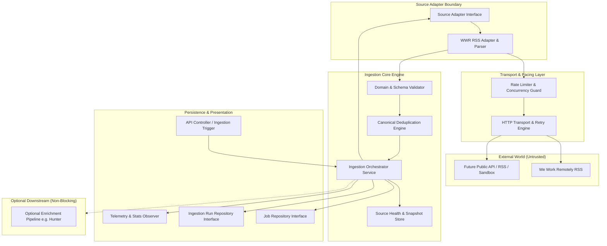
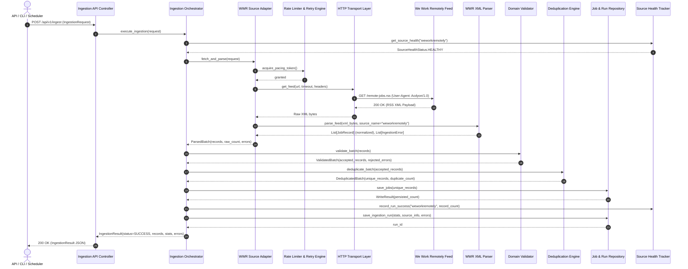

# Target Ingestion Architecture Specification

**System:** Acdyon Job Ingestion Subsystem  
**Role:** Canonical Architecture Document  
**Status:** Approved Architectural Baseline  
**Scope:** Source-independent ingestion pipeline targeting permitted public job sources (Primary Live Source: We Work Remotely RSS).

---

## 1. Architecture Overview & Core Intent

The primary objective of the Acdyon Ingestion Subsystem is to reliably retrieve, sanitize, normalize, deduplicate, and persist job listings from permitted public feeds or APIs without coupling the internal application domain to external source structures.

### The Architectural Boundary
The architecture enforces a strict boundary between two worlds:
1. **External Source-Specific World:** RSS XML schemas, third-party HTTP quirks, non-standard field naming, tracking query parameters, and transient upstream network failures.
2. **Internal Canonical Application Domain:** Strongly typed, immutable, validated canonical models ([`JobRecord`](file:///c:/Users/anand/Desktop/Acdyon/src/domain/job.py#L65), [`SourceInfo`](file:///c:/Users/anand/Desktop/Acdyon/src/domain/source.py#L15), [`IngestionStats`](file:///c:/Users/anand/Desktop/Acdyon/src/domain/ingestion.py#L74), [`IngestionError`](file:///c:/Users/anand/Desktop/Acdyon/src/domain/errors.py#L38)) that downstream services, databases, APIs, and UIs consume without knowing what external source provided the data.



---

## 2. Component Responsibilities & Boundaries

The system is decomposed into 12 single-responsibility components with strict operational contracts:

```
┌────────────────────────────────────────────────────────────────────────────┐
│                        11. API PRESENTATION LAYER                          │
└─────────────────────────────────────┬──────────────────────────────────────┘
                                      ▼
┌────────────────────────────────────────────────────────────────────────────┐
│                      10. INGESTION ORCHESTRATOR                            │
│ ┌────────────────────────┐  ┌──────────────────┐  ┌──────────────────────┐ │
│ │ 9. SOURCE HEALTH STORE │  │ 6. VALIDATOR     │  │ 7. DEDUPLICATOR      │ │
│ └────────────────────────┘  └──────────────────┘  └──────────────────────┘ │
└───────────────────┬───────────────────────────────────┬────────────────────┘
                    ▼                                   ▼
┌──────────────────────────────────────┐   ┌─────────────────────────────────┐
│     1. SOURCE ADAPTER BOUNDARY       │   │     8. PERSISTENCE BOUNDARY     │
│ ┌──────────────────────────────────┐ │   │ ┌─────────────────────────────┐ │
│ │ 5. SOURCE PARSER & NORMALIZATION │ │   │ │ Job & Run Repositories      │ │
│ └──────────────────────────────────┘ │   │ └─────────────────────────────┘ │
└───────────────────┬──────────────────┘   └─────────────────────────────────┘
                    ▼
┌──────────────────────────────────────┐   ┌─────────────────────────────────┐
│   2. TRANSPORT / FETCH LAYER         │   │     12. OPTIONAL ENRICHMENT     │
│ ┌──────────────────────────────────┐ │   │ ┌─────────────────────────────┐ │
│ │ 3. Rate Limiter | 4. Retry Engine│ │   │ │ Downstream Observer         │ │
│ └──────────────────────────────────┘ │   │ └─────────────────────────────┘ │
└──────────────────────────────────────┘   └─────────────────────────────────┘
```

### 1. Source Adapter Boundary (`BaseSourceAdapter`)
* **Responsibility:** Standard contract for querying an external source and returning raw text/payloads. Translates domain requests into source-specific URL endpoints and query arguments.
* **Inputs:** [`IngestionRequest`](file:///c:/Users/anand/Desktop/Acdyon/src/domain/ingestion.py#L24).
* **Outputs:** Source payload, HTTP response metadata, raw records.
* **Dependencies:** Transport layer, Rate Limiter.
* **Forbidden Responsibilities:** Database persistence, direct database models, FastAPI request handling, enrichment, or modifying canonical domain schemas.

### 2. Transport / Fetch Layer (`HttpTransport`, `FetchPolicy`)
* **Responsibility:** Low-level HTTP execution, request timeouts, streaming limits, response status classification, User-Agent management, and connection pooling.
* **Inputs:** Target URL, HTTP headers, query parameters, timeout configurations.
* **Outputs:** Raw bytes/text response, status code, response headers, elapsed duration.
* **Dependencies:** HTTP client library (`httpx`).
* **Forbidden Responsibilities:** Parsing XML/JSON into jobs, validating domain rules, persistence.

### 3. Rate-Limiting Policy (`TokenBucketRateLimiter`)
* **Responsibility:** Enforces pacing per source domain, concurrency throttling, and prevents request bursts across concurrent threads/tasks.
* **Configuration:** Configurable requests-per-second, burst capacity, and minimum cooldown interval per source.
* **Forbidden Responsibilities:** Modifying request payloads or knowing source-specific XML structures.

### 4. Retry and Backoff Engine (`RetryPolicy`)
* **Responsibility:** Evaluates error retryability, applies exponential backoff with full jitter, honors `Retry-After` HTTP response headers, and caps maximum retries.
* **Retryable Conditions:** HTTP 429 (Rate Limited), HTTP 502/503/504 (Gateway/Service Unavailable), TCP connection timeouts, DNS resolution blips.
* **Non-Retryable Conditions:** HTTP 400 (Bad Request), HTTP 401/403 (Auth/Forbidden), HTTP 404 (Not Found), XML syntax errors, malformed responses.
* **Telemetry:** Records retry attempts and failed requests into [`IngestionStats`](file:///c:/Users/anand/Desktop/Acdyon/src/domain/ingestion.py#L74).

### 5. Source Parser and Normalizer (`WWRRSSParser`)
* **Responsibility:** Parses raw source format (e.g. WWR RSS XML / CDATA) into raw record dictionaries and converts them into [`JobRecord`](file:///c:/Users/anand/Desktop/Acdyon/src/domain/job.py#L65) instances.
* **Normalizations Performed:**
  - Strips HTML tags from title/company.
  - Splits WWR title conventions (`Company: Title` or `Title at Company`) cleanly.
  - Formats HTML descriptions into sanitized content.
  - Extracts published dates and normalizes them to UTC datetimes.
  - Extracts employment type and salary text if present in title or categories.
  - Generates deterministic canonical IDs using [`generate_canonical_id`](file:///c:/Users/anand/Desktop/Acdyon/src/domain/identity.py#L51).
* **Forbidden Responsibilities:** Direct database queries, network requests, enrichment.

### 6. Validation Boundary (`DomainValidator`)
* **Responsibility:** Schema and business-rule validation of normalized job records prior to deduplication and persistence.
* **Batch Isolation:** A failure in an individual record (e.g. missing required field, oversized text, invalid URL) generates a scoped [`IngestionError`](file:///c:/Users/anand/Desktop/Acdyon/src/domain/errors.py#L38) (`scope=ErrorScope.RECORD`), increments `records_rejected`, and is quarantined without halting valid sibling records.
* **Forbidden Responsibilities:** Modifying raw source feeds or executing network I/O.

### 7. Deduplication and Identity Engine (`DeduplicationService`)
* **Responsibility:** Ensures idempotency across repeated ingestion runs and within the same ingestion batch.
* **Two-Tier Deduplication:**
  1. *In-Memory Batch Tier:* Eliminates duplicate records inside the same fetch payload using `canonical_id`.
  2. *Persistence Tier:* Performs `UPSERT` (on `canonical_id` conflict) to update existing jobs without creating duplicate rows, updating `ingested_at` while preserving original `published_at`.
* **Forbidden Responsibilities:** Direct parsing of XML feeds.

### 8. Persistence Boundary (`JobRepository`, `IngestionRunRepository`)
* **Responsibility:** Abstract interface for saving valid normalized jobs, ingestion run summaries, and source health records.
* **Interface Methods:**
  - `save_jobs(jobs: List[JobRecord]) -> RepositoryWriteResult`
  - `get_job_by_canonical_id(canonical_id: str) -> Optional[JobRecord]`
  - `save_ingestion_run(stats: IngestionStats, source_info: SourceInfo, errors: List[IngestionError]) -> str`
  - `get_last_known_good_jobs(source_name: str, limit: int) -> List[JobRecord]`
* **Database Agnostic:** Works with Postgres/Supabase, SQLite, or in-memory repositories without changing domain or orchestration logic.

### 9. Source Health & Last-Known-Good Snapshot Store (`SourceHealthTracker`)
* **Responsibility:** Tracks provider health ([`SourceHealthStatus`](file:///c:/Users/anand/Desktop/Acdyon/src/domain/enums.py#L41)), records consecutive failures, and maintains pointers to the latest successful snapshot of jobs to serve as a stale fallback during total upstream outages.
* **Forbidden Responsibilities:** Scraping or fetching feeds.

### 10. Ingestion Orchestrator (`IngestionService`)
* **Responsibility:** Central coordination of the entire ingestion lifecycle.
* **Pipeline Execution:**
  1. Validates [`IngestionRequest`](file:///c:/Users/anand/Desktop/Acdyon/src/domain/ingestion.py#L24).
  2. Invokes appropriate Source Adapter with pacing and retry policies.
  3. Receives parsed canonical records and structured errors.
  4. Runs domain validation and in-memory deduplication.
  5. Persists valid records and run statistics via repository interfaces.
  6. Updates source health tracking.
  7. Returns the final [`IngestionResult`](file:///c:/Users/anand/Desktop/Acdyon/src/domain/ingestion.py#L161).
* **Forbidden Responsibilities:** SQL generation, HTTP socket handling, HTML/XML parsing.

### 11. API Presentation Layer (`IngestionRouter`)
* **Responsibility:** Exposes REST endpoints (e.g. `POST /api/v1/ingest`, `GET /api/v1/ingest/status`, `GET /api/v1/jobs`) for triggers, testing, and UI dashboards.
* **Forbidden Responsibilities:** Ingestion business logic or source parsing.

### 12. Optional Enrichment Pipeline (`EnrichmentService`)
* **Responsibility:** Non-blocking downstream hook for enriching jobs (e.g. company domain lookup, contact discovery) *after* successful persistence.
* **Isolation Guarantee:** Primary ingestion success is 100% decoupled from enrichment. Enrichment failures never fail an ingestion run or prevent jobs from being published.

---

## 3. Layered Dependency Direction & Architecture Rules

The architecture follows the **Clean Architecture / Ports and Adapters** paradigm. Dependencies point strictly inward toward the domain core.

```
       ┌──────────────────────────────────────────────────────────┐
       │                   OUTER INFRASTRUCTURE                   │
       │  FastAPI Routes  │  Supabase/Postgres  │  HTTPX Transport│
       └────────────────────────────┬─────────────────────────────┘
                                    │ (depends on)
                                    ▼
       ┌──────────────────────────────────────────────────────────┐
       │                APPLICATION & ORCHESTRATION               │
       │  IngestionService │ Adapters │ Repositories │ Validator  │
       └────────────────────────────┬─────────────────────────────┘
                                    │ (depends on)
                                    ▼
       ┌──────────────────────────────────────────────────────────┐
       │                  CANONICAL DOMAIN CORE                   │
       │  JobRecord │ SourceInfo │ IngestionStats │ Errors │ Enums│
       └──────────────────────────────────────────────────────────┘
```

### Strict Architectural Dependency Rules

| Layer | Can Import From | MUST NEVER Import From |
|---|---|---|
| **Domain Layer** (`src/domain/`) | Python standard library, Pydantic | Ingestion service, Adapters, Repositories, Database drivers, FastAPI, HTTP clients |
| **Orchestration Layer** (`src/services/`) | Domain Layer, Abstract Repository & Adapter Interfaces | Framework routers (FastAPI), Concrete DB drivers, Source-specific XML parsers |
| **Adapter Layer** (`src/adapters/`) | Domain Layer, Transport Interfaces, Parser utilities | Repositories, FastAPI routes, Downstream enrichment |
| **Persistence Layer** (`src/storage/`) | Domain Layer, Abstract Repository Interfaces, SQL/DB drivers | Source Adapters, HTTP Transport, FastAPI routers |
| **API Layer** (`src/api/`) | Domain Layer, Orchestration Service | Raw HTTP transport, Source Adapters, Source Parsers |

---

## 4. End-to-End Ingestion Data Flow



---

## 5. Failure-Handling Architecture & Scenario Matrix

The system classifies, isolates, and recovers from failures deterministically across 8 distinct scenarios:

| Scenario | Trigger / Cause | Immediate Action | Retry Behavior | Telemetry & Health Impact | Data State & Fallback |
|---|---|---|---|---|---|
| **A. Request Timeout** | Upstream server hanging or slow connection (> 10s). | Abort request via socket timeout. | Exponential backoff (1s, 2s, 4s) up to 3 attempts with random jitter. | Increment `retries` and `failed_requests`. If all fail: set `SourceHealthStatus.DEGRADED`, emit [`IngestionErrorType.TIMEOUT_ERROR`](file:///c:/Users/anand/Desktop/Acdyon/src/domain/enums.py#L62). | Preserve existing database records. Return last-known-good snapshot if available. |
| **B. HTTP 429 Rate Limit** | Provider rate limit exceeded. | Parse `Retry-After` header. If absent, apply backoff base * 2. | Wait specified duration (capped at 60s). Max 2 retries. | Increment `failed_requests`, record `RATE_LIMIT_ERROR`. Mark source `DEGRADED`. | Back off cleanly without hammering upstream. Fall back to existing cached jobs. |
| **C. HTTP 5xx Server Error** | Upstream 500/502/503/504 outage. | Log status code and error snippet. | Retry up to 3 times with exponential backoff. | If unresolved, record `SOURCE_SERVER_ERROR`. Mark source `DEGRADED` or `UNREACHABLE`. | Never overwrite or delete active jobs. Ingestion status marked `FAILED`. |
| **D. HTTP 4xx (Non-429)** | Bad URL, HTTP 403 Forbidden, 404 Not Found. | Fail fast immediately. | **Zero retries** (client/config error). | Record `NETWORK_TRANSPORT_ERROR` (`scope=REQUEST`), mark source `DEGRADED`. | Return failed [`IngestionResult`](file:///c:/Users/anand/Desktop/Acdyon/src/domain/ingestion.py#L161) with diagnostics. |
| **E. Malformed Feed XML** | Truncated XML, unclosed tags, invalid syntax. | XML parser captures exception. | **Zero retries** (payload is deterministically invalid). | Record `MALFORMED_RESPONSE_ERROR` (`scope=RUN`). Mark source `DEGRADED`. | Zero invalid records persisted. Prior database records remain untouched. |
| **F. Single Invalid Record** | 1 out of 100 jobs has missing title or invalid URL. | Schema validator rejects record. | No retry needed for single record. | Record `INVALID_RECORD_ERROR` (`scope=RECORD`). Increment `records_rejected`. | 99 valid records proceed to persistence. Run marked `PARTIAL_SUCCESS`. |
| **G. Empty Feed Response** | Feed returns 0 items. | Evaluate heuristics: Status 200 vs 304, XML validity, channel metadata. | If XML is valid and channel indicates 0 active jobs: classify as `SUCCESS` (0 items). If unexpected total drop from historical average: log warning. | Health remains `HEALTHY`. `records_received=0`, `records_accepted=0`. | No deletion of existing records unless explicit expiration is indicated. |
| **H. Source Recovery** | Successful fetch following previous degradation. | Process records normally. | Normal execution. | Reset consecutive failure count. Set `SourceHealthStatus.HEALTHY`. Record `SUCCESS`. | Database updated with fresh records. |

---

## 6. Security & Compliance Architecture

### Security Boundaries
1. **Untrusted External Data:** All RSS payloads are treated as untrusted text. XML entity expansion (`XXE`) is disabled in parsers (`defusedxml` / standard secure parser flags). HTML in descriptions is sanitized before rendering.
2. **SSRF Protection:** Outbound requests are strictly restricted to configured source endpoints (e.g. `https://weworkremotely.com/remote-jobs.rss`). Dynamic user-supplied request URLs are forbidden.
3. **Secret Redaction:** Domain contracts and logging layers recursively redact sensitive headers (`Authorization`, `Cookie`, `X-API-Key`, `Password`) to prevent token leaks in logs or telemetry ([`IngestionError._sanitize_details`](file:///c:/Users/anand/Desktop/Acdyon/src/domain/errors.py#L18)).
4. **Resource Constraints:**
   - Maximum HTTP response size: 10 MB.
   - Socket connection timeout: 5.0 seconds; read timeout: 10.0 seconds.
   - Maximum job description size: 100,000 characters.
   - Maximum batch limit: 1,000 records.
5. **Failure Simulation Boundary:** Test simulation endpoints or hooks are strictly guarded behind environment flags (`ENV != production`) and forbidden in production builds.

### Compliance & Ethical Ingestion Boundary
- Target: Only permitted public job feeds (We Work Remotely public RSS).
- Identity: Custom transparent User-Agent header: `Acdyon-JobIngest/1.0 (Assessment Evaluation; +https://github.com/anand/acdyon)`.
- Pacing: Minimum 3-second interval between consecutive requests to the same host.
- Zero Evasion: No CAPTCHA solving, no rotating proxy networks, no browser fingerprint manipulation, no private candidate data scraping, and zero interaction with live LinkedIn interfaces.

---

## 7. Minimal Production Deployment Topology

The system is designed with a **Single-Process Async Architecture** to maximize operational reliability and eliminate distributed system failure modes during assessment evaluation.

```
┌────────────────────────────────────────────────────────────────────────────┐
│                  ACDYON INGESTION SERVICE (FastAPI / Uvicorn)               │
│                                                                            │
│  ┌───────────────────────┐                  ┌───────────────────────────┐  │
│  │   REST API Routes     │                  │   Async Ingestion Worker  │  │
│  │ (Trigger / Dashboard) │                  │  (Paced Fetch & Pipeline) │  │
│  └───────────┬───────────┘                  └─────────────┬─────────────┘  │
│              │                                            │                │
│              └──────────────────────┬─────────────────────┘                │
│                                     ▼                                      │
│                       [ Ingestion Orchestrator ]                           │
│                                     │                                      │
│                    ┌────────────────┴────────────────┐                     │
│                    ▼                                 ▼                     │
│          [ Source Adapters ]              [ Repository Interface ]         │
│          (WWR RSS with HTTPX)             (Postgres / Supabase / SQLite)   │
└────────────────────┬─────────────────────────────────┬─────────────────────┘
                     │                                 │
                     ▼                                 ▼
      [ We Work Remotely RSS Feed ]        [ PostgreSQL / Supabase DB ]
```

### Why No Heavy Distributed Queue (Kafka / RabbitMQ / Celery)?
1. **Throughput Requirements:** WWR RSS updates periodically (hourly/daily). A feed of ~100–500 items takes < 2 seconds to fetch, parse, validate, and store. A message broker introduces unnecessary operational complexity, connection pools, serialization overhead, and deployment points of failure.
2. **Deterministic Observability:** A single-process async model allows the caller to receive an immediate, complete [`IngestionResult`](file:///c:/Users/anand/Desktop/Acdyon/src/domain/ingestion.py#L161) containing precise telemetry and execution errors.
3. **Deployment Simplicity:** Can be deployed as a single container on Render, Fly.io, Railway, or standard VPS with zero external message broker dependencies.

---

## 8. Comprehensive Testing Strategy

The test architecture guarantees isolation by testing all business logic with mock fixtures without requiring live network access for routine test runs:

```
┌────────────────────────────────────────────────────────────────────────────┐
│                         5. Failure Simulation Tests                        │
│            (Simulated 429, 500, timeouts, malformed XML payloads)          │
├────────────────────────────────────────────────────────────────────────────┤
│                         4. Integration Tests                               │
│            (Repository database operations, SQLite/Postgres tests)         │
├────────────────────────────────────────────────────────────────────────────┤
│                         3. Service & Orchestration Tests                   │
│            (Mock adapter, retry count verification, partial success)       │
├────────────────────────────────────────────────────────────────────────────┤
│                         2. Source Adapter & Parser Tests                   │
│            (Static WWR XML fixtures, dirty CDATA, date variations)         │
├────────────────────────────────────────────────────────────────────────────┤
│                         1. Unit Tests (Established)                        │
│            (Domain contracts, Pydantic validation, canonical ID)           │
└────────────────────────────────────────────────────────────────────────────┘
```

### Test Suite Structure
1. **Unit Tests (`tests/unit/`):** Test canonical models ([`JobRecord`](file:///c:/Users/anand/Desktop/Acdyon/src/domain/job.py#L65), [`SourceInfo`](file:///c:/Users/anand/Desktop/Acdyon/src/domain/source.py#L15), [`IngestionStats`](file:///c:/Users/anand/Desktop/Acdyon/src/domain/ingestion.py#L74), [`IngestionError`](file:///c:/Users/anand/Desktop/Acdyon/src/domain/errors.py#L38)), URL canonicalization, and deterministic ID hashing. (28 tests active).
2. **Adapter & Parser Tests (`tests/adapters/`):** Test `WWRRSSParser` against static XML fixture files (`tests/fixtures/wwr_valid.xml`, `wwr_missing_fields.xml`, `wwr_malformed.xml`).
3. **Service Orchestration Tests (`tests/services/`):** Test `IngestionService` with mock adapters to verify retry limits, partial error aggregation, and telemetry.
4. **Storage Integration Tests (`tests/storage/`):** Test `JobRepository` and `IngestionRunRepository` implementations using SQLite (in-memory test DB) and PostgreSQL.
5. **End-to-End & Failure Tests (`tests/e2e/`):** Test complete pipeline execution against simulated network conditions and mock HTTP servers (`pytest-httpx` / `respx`).

---

## 9. Concrete Target Repository Structure

The target repository structure maps directly to the architectural boundaries:

```
Acdyon/
├── pyproject.toml                     # Dependencies, packaging, pytest configuration
├── README.md                          # Quickstart, contracts overview, and architecture guide
├── ARCHITECTURE.md                    # This architecture specification
├── src/
│   ├── domain/                        # CANONICAL DOMAIN LAYER (Zero external dependencies)
│   │   ├── __init__.py                # Exported contracts and enums
│   │   ├── enums.py                   # JobStatus, IngestionRunStatus, SourceType, etc.
│   │   ├── errors.py                  # IngestionError with automatic secret redaction
│   │   ├── identity.py                # Deterministic ID generation & URL canonicalization
│   │   ├── ingestion.py               # IngestionRequest, IngestionStats, IngestionResult
│   │   ├── job.py                     # JobRecord, SalaryInfo domain models
│   │   └── source.py                  # SourceInfo metadata model
│   │
│   ├── transport/                     # NETWORK & PACING LAYER
│   │   ├── __init__.py
│   │   ├── client.py                  # HTTPX client wrapper with timeout & header policies
│   │   ├── limiter.py                 # TokenBucketRateLimiter (source pacing)
│   │   └── retry.py                   # Jittered exponential backoff & Retry-After handler
│   │
│   ├── adapters/                      # SOURCE ADAPTERS & PARSERS
│   │   ├── __init__.py
│   │   ├── base.py                    # BaseSourceAdapter abstract interface
│   │   └── wwr/                       # We Work Remotely Implementation
│   │       ├── __init__.py
│   │       ├── adapter.py             # WWRSourceAdapter
│   │       └── parser.py              # WWRRSSParser (XML/CDATA -> JobRecord)
│   │
│   ├── services/                      # APPLICATION ORCHESTRATION LAYER
│   │   ├── __init__.py
│   │   ├── orchestrator.py            # IngestionService (central coordinator)
│   │   ├── validator.py               # Domain batch validator & quarantine
│   │   ├── deduplicator.py            # In-memory batch deduplication engine
│   │   └── health.py                  # SourceHealthTracker & snapshot provider
│   │
│   ├── storage/                       # PERSISTENCE LAYER (Database Agnostic)
│   │   ├── __init__.py
│   │   ├── base.py                    # Abstract JobRepository & IngestionRunRepository
│   │   ├── memory.py                  # In-memory repository (for testing/dev)
│   │   └── postgres.py                # PostgreSQL / Supabase SQL repository
│   │
│   └── api/                           # PRESENTATION LAYER
│       ├── __init__.py
│       ├── app.py                     # FastAPI application factory
│       ├── routes.py                  # Ingestion triggers, status, and job queries
│       └── schemas.py                 # API request/response DTOs (thin wrappers)
│
└── tests/
    ├── __init__.py
    ├── conftest.py                    # Shared fixtures, test settings, mock HTTP client
    ├── fixtures/                      # Sample RSS/XML feeds for deterministic tests
    │   ├── wwr_valid.xml
    │   ├── wwr_malformed.xml
    │   └── wwr_edge_cases.xml
    ├── unit/                          # Unit tests (Domain models, identity)
    │   ├── test_domain_models.py
    │   └── test_identity.py
    ├── adapters/                      # Parser & Adapter unit tests
    │   └── test_wwr_parser.py
    ├── services/                      # Orchestrator & validation tests
    │   └── test_orchestrator.py
    └── storage/                       # Repository integration tests
        └── test_repositories.py
```

---

## 10. Architectural Decision Records (ADRs)

### ADR 1: Isolation of Source Adapters and XML Parsers
* **Decision:** Keep XML parsing logic in source-specific modules (`src/adapters/wwr/parser.py`) and return canonical [`JobRecord`](file:///c:/Users/anand/Desktop/Acdyon/src/domain/job.py#L65) lists.
* **Rationale:** Completely insulates the rest of the application from RSS/XML changes. If WWR adds a new RSS tag or changes date formats, only `parser.py` is edited.
* **Alternative Considered:** Generic XML-to-dict mapper in the orchestrator.
* **Trade-off:** Requires writing a dedicated parser per source, but ensures 100% type safety and clean mapping.

### ADR 2: Two-Tier Deduplication Strategy
* **Decision:** Combine in-memory batch deduplication with database-level `UPSERT` on `canonical_id`.
* **Rationale:** In-memory deduplication catches duplicate items within the same RSS feed before persistence overhead; database `UPSERT` provides cross-run idempotency without locking tables.
* **Alternative Considered:** Distributed Redis lock or check-before-insert queries.
* **Trade-off:** Requires database unique constraint on `canonical_id`, which is standard best practice.

### ADR 3: Abstract Repository Pattern over Direct Supabase Client
* **Decision:** Introduce [`BaseJobRepository`](file:///c:/Users/anand/Desktop/Acdyon/src/storage/base.py) interface with concrete Postgres and in-memory implementations.
* **Rationale:** Decouples domain logic from Supabase/Postgres. Allows fast local unit testing with in-memory storage and easy migration to alternative databases if needed.
* **Alternative Considered:** Direct Supabase client calls inside the orchestrator.
* **Trade-off:** Adds an interface layer, but eliminates vendor lock-in and enables isolated testing.

### ADR 4: Decoupled Non-Blocking Enrichment Pipeline
* **Decision:** Downstream enrichment (e.g. Hunter email finding) is invoked as an optional post-ingestion observer and never blocks primary ingestion success.
* **Rationale:** Ingestion must remain reliable even if third-party enrichment APIs are rate-limited, slow, or down.
* **Alternative Considered:** Inline synchronous enrichment inside the source parser.
* **Trade-off:** Enrichment data is attached asynchronously rather than during initial parsing, which drastically improves ingestion resilience.

---

## 11. Architecture Self-Challenge & Critical Review

1. **Where is the smallest useful abstraction boundary?**  
   The [`BaseSourceAdapter`](file:///c:/Users/anand/Desktop/Acdyon/src/adapters/base.py) boundary. It separates external transport and parsing from internal domain logic with only 1 interface method (`fetch_and_parse(request) -> ParsedBatch`).
2. **Which abstraction could be removed without losing reliability?**  
   A separate message queue / broker was deliberately omitted. Removing it eliminates 5 failure points without sacrificing reliability.
3. **What component becomes the bottleneck if ingestion frequency increases?**  
   Database write I/O during large batch upserts. Mitigated by bulk upserts (`INSERT ... ON CONFLICT DO UPDATE`) rather than single-row queries.
4. **What happens if WWR disappears tomorrow?**  
   The system emits a structured [`IngestionError`](file:///c:/Users/anand/Desktop/Acdyon/src/domain/errors.py#L38), marks the source `UNREACHABLE`, serves existing jobs from the last-known-good database snapshot, and allows adding a new adapter (e.g. RemoteOK RSS) without touching the orchestrator.
5. **What happens if the feed returns valid XML but completely different semantics?**  
   The domain validation stage catches missing/malformed fields, rejects invalid records, logs [`IngestionErrorType.INVALID_RECORD_ERROR`](file:///c:/Users/anand/Desktop/Acdyon/src/domain/enums.py#L65), and preserves database integrity.
6. **What happens if two ingestion requests run concurrently?**  
   The in-memory rate limiter / semaphore prevents outbound request bursts; database `UPSERT` ensures concurrent writes to the same `canonical_id` update idempotently without corrupting data.
7. **What prevents a temporary source failure from becoming permanent data loss?**  
   The repository never drops or truncates existing job records during an ingestion run; it only upserts new or updated postings.
8. **What prevents a retry mechanism from becoming a request storm?**  
   Capped maximum retries (3), exponential backoff with full randomized jitter, respect for `Retry-After` headers, and token bucket rate limiting.
9. **What part of the system would be hardest to explain during an interview?**  
   The deterministic identity precedence hierarchy (Source ID -> Normalized URL -> Composite Hash). Documented clearly in [`src/domain/identity.py`](file:///c:/Users/anand/Desktop/Acdyon/src/domain/identity.py).
10. **What part can be simplified given the assessment deadline?**  
    Start with an in-memory/SQLite repository during initial adapter implementation, then connect the PostgreSQL/Supabase repository in the persistence step.

---

## 12. Identified Risks & Open Review Questions

- **Risk 1: WWR Feed Formatting Variations** — Some WWR entries include company names in the title (e.g. `Acme: Senior Engineer`), while others use standard tags.  
  *Mitigation:* The `WWRRSSParser` includes regex-based title extraction with safe fallback to `<author>` or default values.
- **Risk 2: Remote Upstream Cloudflare / Bot Protection** — Even public RSS feeds can occasionally trigger Cloudflare rate checks if requested aggressively.  
  *Mitigation:* Conservative pacing (minimum 3s intervals), transparent descriptive User-Agent, and ETag/Last-Modified conditional HTTP headers.
- **Open Question for Implementation:** Do we demonstrate with the global WWR feed (`https://weworkremotely.com/remote-jobs.rss`) or a category feed (`https://weworkremotely.com/categories/remote-back-end-programming-jobs.rss`)? Both use identical XML schemas and are interchangeable via [`IngestionRequest.category`](file:///c:/Users/anand/Desktop/Acdyon/src/domain/ingestion.py#L46).
